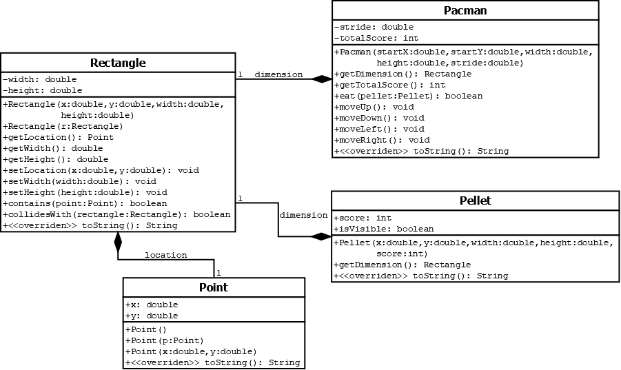

# Pacman Game

This repository contains the implementation of a Pacman game in Java. The game involves a Pacman character that moves around a 2D game world, eating pellets and accumulating scores.

## Problem Description

In most game development platforms, 2D game objects are rendered on a Cartesian plane. Rectangles are commonly used to represent game objects, and they are defined by their location, width, and height attributes. The location represents the anchor point of the rectangle, and the width and height define the area covered by the rectangle.

The game also involves collision detection between rectangles. A rectangle is considered to collide with another rectangle if their bounds intersect.

The Pacman game is implemented using classes that represent different game objects, including Pacman itself, pellets, rectangles, and points.



### Rectangle

- Implement the `Rectangle` class according to the provided UML diagram with the following constraints:
  - Implement the attributes, constructors, accessors, and mutators as shown in the UML class diagram.
  - Handle the initialization of attributes correctly, considering constraints such as width and height values being non-negative.
  - Implement the `contains(Point point)` method to check if a point is inside the area of the rectangle.
  - Implement the `collidesWith(Rectangle rectangle)` method to check if the current rectangle collides with another rectangle.
  - Override the `toString()` method to provide a formatted string representation of the rectangle.

### Pacman

- Implement the `Pacman` class according to the provided UML diagram with the following constraints:
  - Implement the attributes as shown in the UML class diagram.
  - Handle the initialization of attributes correctly in the constructor.
  - Implement the `eat(Pellet pellet)` method to allow Pacman to eat a pellet, updating its total score if the pellet is visible and collides with Pacman's bounds.
  - Implement methods (`moveUp()`, `moveDown()`, `moveLeft()`, `moveRight()`) to update Pacman's location attribute based on its stride value.
  - Override the `toString()` method to provide a formatted string representation of Pacman.

### Pellet

- Implement the `Pellet` class according to the provided UML diagram with the following constraints:
  - Implement the attributes as shown in the UML class diagram.
  - Handle the initialization of attributes correctly in the constructor.
  - Implement the `getDimension()` accessor to return a copy object of the `dimension` attribute.
  - Override the `toString()` method to provide a formatted string representation of the pellet.

### Point

- Implement the `Point` class according to the provided UML diagram with the following constraints:
  - Implement the attributes and constructors as shown in the UML class diagram.
  - Handle the initialization of attributes correctly in the constructors.
  - Override the `toString()` method to provide a formatted string representation of the point.

## Usage

The classes provided in this repository can be used to build and run a Pacman game in Java. The specific usage depends on the requirements and design of the game. Refer to the class descriptions and constraints for guidance on how to use the implemented classes.

## Contribution

Contributions to this repository are welcome. If you would like to contribute, please follow these steps:

1. Fork the repository by clicking on the "Fork" button on the repository's page.

2. Clone your forked repository to your local machine:

   ```
   git clone https://github.com/your-username/name-of-repo.git
   ```

3. Create a new branch for your changes:

   ```
   git checkout -b feature/new-feature
   ```

4. Make your desired changes and commit them:

   ```
   git commit -m "Add new feature"
   ```

5. Push your changes to your forked repository:

   ```
   git push origin feature/new-feature
   ```

6. Open a pull request on the original repository's page and describe your changes.

Once your pull request is reviewed and approved, it will be merged into the main repository. Thank you for your contribution!

## Credits

This project was developed by Sir Jomari Joseph Barera, an instructor at Visayas State University. The project covers the concepts of creating classes and inheritance in Java. This is one of the problems on the Midterm Laboratory Exam for JAVA OOP in July 2023.
